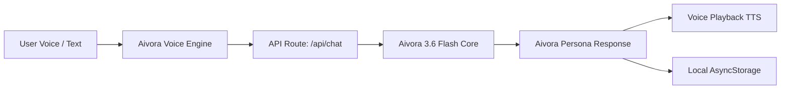

# Aivora — Intelligent AI Voice Assistant

<p align="center">
  
</p>

<p align="center">
  <strong>A modern, responsive, and privacy-focused AI Voice Assistant mobile app built with Expo, React Native, NativeWind/Tailwind, and Aivora High-Speed Neural Core.</strong>
</p>

<p align="center">
  <a href="#features">Features</a> •
  <a href="#how-it-works">How It Works</a> •
  <a href="#tech-stack">Tech Stack</a> •
  <a href="#project-structure">Project Structure</a> •
  <a href="#privacy--storage">Privacy</a>
</p>

---

## ✨ Features

### 🎙️ 1. Intelligent Voice & Audio Interaction
- **One-Tap Voice Input:** Speak naturally into your mobile microphone or browser.
- **Dynamic 8-Bar Waveform Frequency Visualizer:** Real-time animated audio equalizer graph during voice listening and speech output.
- **Natural Voice Playback (TTS):** Automatic audio synthesis reading answers aloud.
- **Voice Playback Controller:** Dedicated stop button to halt playback anytime.

### 🔒 2. Persistent Local Storage (100% On-Device Privacy)
- **Persistent Conversation History:** Chat history is saved locally on your device with full persistence.
- **On-Demand Cache Clearance:** Easily clear chat cache and history anytime from settings.
- **Cross-Platform Storage:** Native `AsyncStorage` on iOS/Android and fallback `localStorage` on Web.

### ✏️ 3. Inline Message Editing & Re-Sending
- **Edit Sent Prompts:** Tap the ✏️ pencil icon on any user message to edit the text directly inline.
- **Instant Re-generation:** Re-sending an edited message updates the conversation history and fetches a fresh AI response.

### 💡 4. Smart Starter Prompts & Quick Actions
- **Suggestion Prompt Chips:** Instant-click prompt cards when opening a new chat (*e.g., productivity habits, tech ideas, email drafting*).
- **One-Click Copy:** Copy message text to clipboard with instant visual checkmark feedback.
- **Audio Replay:** Re-play any previous AI response voice at any time.
- **Timestamps:** Clean formatted message timestamps (*e.g., 11:24 AM*).

### ⚙️ 5. Universal AI Model Version Switcher & Controls
- **Header Model Selector:** Instant model version switcher on the top right of the header across all screens.
- **Selectable Intelligence Engines:** Choose between *Aivora 3.6 Flash* (Ultra Fast), *Aivora 3.7 Flash* (Smart & Balanced), *Aivora 3.8 Flash* (Deep Reasoning), and *Aivora Pro Latest* (State-of-the-Art).
- **Auto-Speak Toggle:** Enable or disable automatic voice response playback.
- **One-Tap Cache Clearance:** "Clear All Local Data" button to immediately wipe local conversation cache.
- **Privacy Dashboard:** Overview of local storage retention and security status.

---

## 🚀 How It Works



1. **Input Stage:** The user speaks via mobile microphone or types in the expandable multi-line text input.
2. **Audio Processing:** Native microphone audio is recorded and encoded as Base64 (or transcribed in real-time on web).
3. **AI Core Processing:** Sent securely to `app/api/chat+api.ts` which communicates with the high-speed AI core.
4. **Persona & Response:** The AI responds with natural conversational text adhering to the **Aivora** assistant persona.
5. **Speech Synthesis:** If auto-speak is enabled, native Text-To-Speech (TTS) plays the voice response immediately.
6. **Local Persistence:** The conversation is stored locally in device storage with complete privacy.

---

## 🛠️ Tech Stack

- **Framework:** [Expo](https://expo.dev) (~v56) with [React Native](https://reactnative.dev) (v0.76+ / React 19)
- **Routing:** [Expo Router](https://docs.expo.dev/router/introduction/) (File-based navigation with tabs and auth flow)
- **Styling:** [NativeWind v4](https://www.nativewind.dev/) (Tailwind CSS for React Native)
- **AI Core:** High-speed 3.6 Flash Neural Architecture with automatic model fallback resilience
- **Audio & Speech:** `expo-audio`, `expo-speech`, `expo-file-system`
- **State Management:** [Zustand](https://github.com/pmndrs/zustand)
- **Storage:** `@react-native-async-storage/async-storage`
- **Icons:** `@expo/vector-icons` (Ionicons)

---

## 📁 Project Structure

```text
Aivora/
├── app/                        # Expo Router Pages & Layouts
│   ├── (auth)/                 # Authentication Flow (Login, Signup, Forgot Password)
│   ├── (tabs)/                 # Bottom Tabs Navigation
│   │   ├── home.tsx            # Main AI Voice Assistant Chat Screen
│   │   ├── profile.tsx         # Aivora Assistant Hub & Capabilities Screen
│   │   └── settings.tsx        # Settings & Privacy Screen
│   ├── api/
│   │   └── chat+api.ts         # Secure AI Backend Endpoint
│   ├── _layout.tsx             # Root Application Layout
│   └── global.css              # Global Tailwind Styles
├── assets/                     # Fonts, App Icons & Splash Screens
├── components/                 # Reusable UI & Header Components
├── constants/                  # Color palettes & Theme Tokens
├── contexts/                   # React Contexts (ThemeContext, etc.)
├── hooks/                      # Custom React Hooks
│   └── useVoiceAssistant.ts    # Central Voice Recording, TTS, STT & Persistent Storage Hook
├── locales/                    # Localization Files (en.json)
├── services/                   # API Clients & Service Handlers
├── stores/                     # Zustand Global Stores (authStore, etc.)
├── types/                      # TypeScript Interfaces & Definitions
│   └── voiceChat.ts            # Voice Chat & Message Types
├── app.json                    # Expo Project Configuration
├── tailwind.config.js          # Tailwind CSS Configuration
└── tsconfig.json               # TypeScript Configuration
```

---

## 🛡️ Privacy & Storage

Aivora is designed with privacy at its core:
- **100% On-Device History:** Conversations are kept directly on the device using `AsyncStorage`.
- **Persistent Local Storage:** Your chat conversations remain securely accessible on your device.
- **Manual Data Wiping:** Users can clear all cached messages at any time with a single tap from the Settings menu.

---

## 📄 License

This project is licensed under the [MIT License](LICENSE).

---

<p align="center">
  Built with ❤️ for <strong>Aivora</strong>
</p>